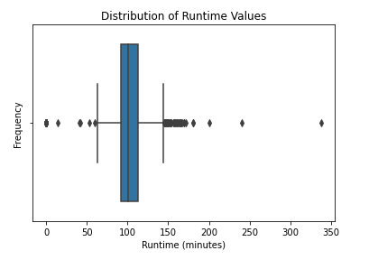
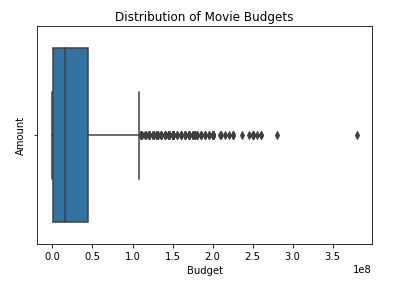
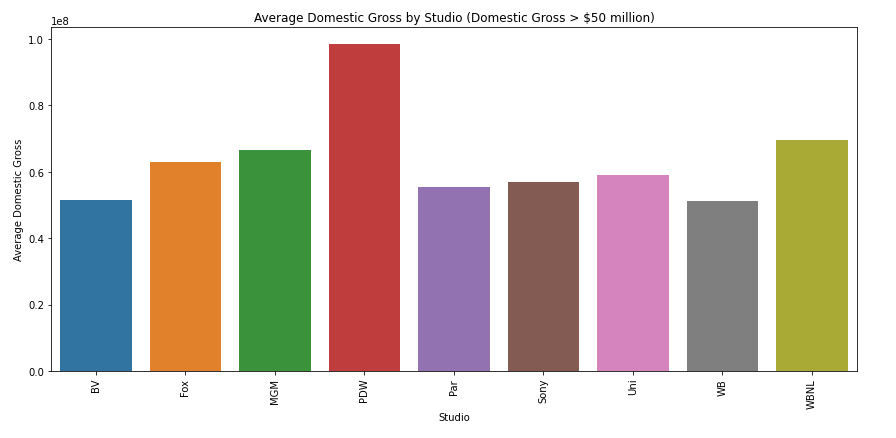
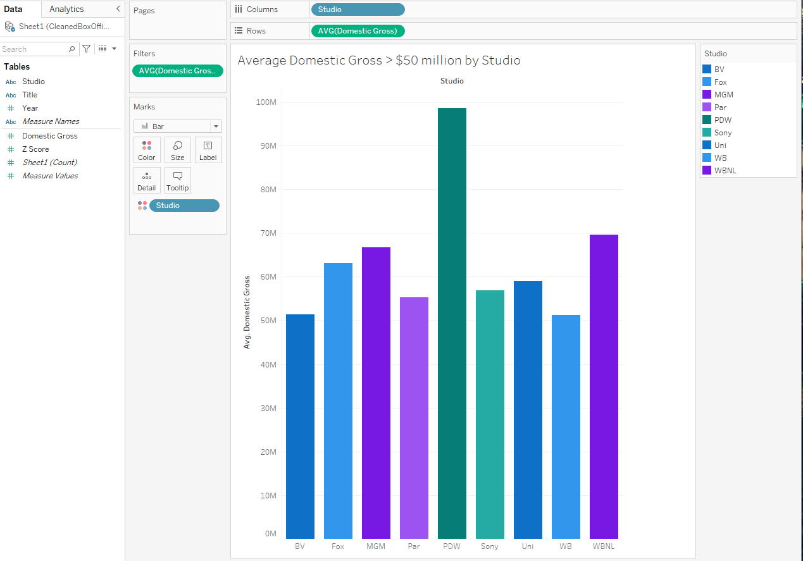

# Lights, Camera, Action!
Our company wants in on the fun of creating original video content like all the big companies aroung them. Because of this, the company has decided they want to start producing movies.  The problem is they have never done this.  They are not sure where to start and they don't want to lose money on this.

# Our Data Understanding and Analysis 
We wanted to gather box office performance and trends to gain insight around our decision making.

We were provided raw data sets from several sources stemming from budget, gross revenue, film length, genres, and popularity. We wanted to focus around return on investment based on production budgets, genre, and production companies..
We finalized down to three datasets:  Movie Data
                                      Box Office Mojo
                                      and The Numbers.
You can find these inside the data folder inside this repository.
We used these three datasets to come to conclusions on how best to approach this new business adventure.

# Data Cleaning and EDAs
We started by individually opening, cleaning and exploring each data set.  They do vary in cleaning methods, size, ect. So, for a further look into the coding itself, feel free to read the jupyter notebook titles P2ProjectFinalNotebook.
Below are a few of the EDAs we came up with during our analysis.

First is a box plot of our runtime outliers from our Movie Data source.

Second, is a box plot of our budget outliers also from the Movie Data source.

These last two visualizations represent the Average Domestic Gross > $50 million by studio.  Both came from the Box Office Mojo dataset and show the same information. The one on the top is made using MatPlotLib and the one on the bottom was made using Tableau.
    

Below is the link to Tableau Worksheet.
https://public.tableau.com/app/profile/lotus.baumgarner/viz/DomesticGross50Mil/Sheet1?publish=yes

# In Conclusion...
We would want to consider horror, thriller, and drama genres. We would also want to consider partnering up or consulting with successfully experience production companies. Lastly, we would want to make sure we are wise with our investment and be strategic on how we spend money. Low budget has the potential with the highest reward with minimal negative impact. Thank you all for meeting with us today.
